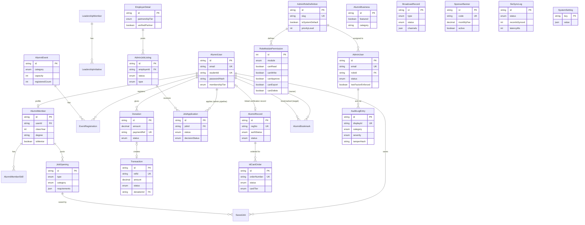

# Database Schema

MySQL via Prisma. Full source: `prisma/schema.prisma`. This doc groups the 27 models by domain and calls out a few decisions worth knowing before you query or extend the schema.

## A note before the diagram: two separate "Job" domains

The schema deliberately has **two unrelated job-related model clusters** — don't conflate them:

- **`JobOpening`** (public) — jobs alumni self-post to the public portal (`app/(public)/jobs`), saved via `SavedJob`.
- **`AdminJobListing`** + **`EmployerDetail`** + **`JobApplication`** (admin) — the back-office recruiting pipeline (`app/admin/(dashboard)/jobs`), with a full application/selection/offer workflow.

They share no foreign keys and are queried/mutated through entirely separate API route trees (`/api/jobs/**` vs `/api/admin/jobs/**`, `/api/admin/employers/**`).

## JSON vs. relational columns

Free-form nested data that's never filtered or joined on is stored as a `Json` column rather than being fully normalized into child tables — e.g. `AlumniEvent.agenda`/`speakers`/`highlights`/`faqs`, `JobOpening.responsibilities`/`requirements`/`benefits`, `TargetAudienceGroup.criteria`, `AdminUser.customPermissionOverrides`, `AuditLogEntry.beforeState`/`afterState`. Fields that genuinely need indexing, filtering, or relational integrity (status enums, dates, foreign keys, unique constraints like `email`/`regNo`/`refId`) are real columns. `AlumniMemberSkill` and `LeadershipInitiative` are the two places a list *was* promoted to a real child table, since skills/initiatives are meaningfully queried elsewhere in the legacy UI.

## Donation → Transaction linkage

`Donation` and `Transaction` are separate models with an optional one-to-one relation (`Transaction.donationId`). `POST /api/donations` creates both in one call — a `Donation` row (the donor-facing record) and a linked `Transaction` row (`status: SETTLED`, `method: "Online Giving"`) — so the admin Finance module (`/api/admin/transactions`) sees every donation without needing to query two separate tables.

## Diagram

## Full model index by domain

**Public / Alumni**: `AlumniUser`, `AlumniMember`, `AlumniMemberSkill`, `LeadershipMember`, `LeadershipInitiative`, `JobOpening`, `SavedJob`, `AlumniEvent`, `EventRegistration`, `AlumniBusiness`, `Donation`, `AlumniBookmark`.

**RBAC / Audit**: `AdminUser`, `AdminRoleDefinition`, `RoleModulePermission`, `AuditLogEntry`.

**Alumni verification & ID cards**: `AlumniRecord`, `IdCardOrder`.

**Broadcast**: `BroadcastMessageTemplate`, `TargetAudienceGroup`, `BroadcastRecord`.

**Commercial & Finance**: `SponsorBanner`, `Transaction`.

**Recruiting (admin)**: `EmployerDetail`, `AdminJobListing`, `JobApplication`.

**System**: `SisSyncLog`, `SystemSetting`.

All 30 enums (membership tiers, job/event categories, verification/status enums for every domain, the RBAC `PermissionModule` enum, etc.) are defined at the top of `prisma/schema.prisma` — read it directly for exact values rather than duplicating the full list here, since it's the single source of truth and this doc would drift from it otherwise.
